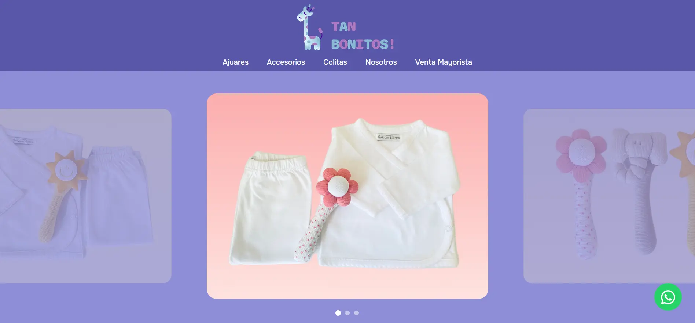

# Tan Bonitos!

A product catalog website for **Tan Bonitos!**, a handmade baby goods artisan brand from Argentina. Built as a freelance project to showcase their products and connect with customers via WhatsApp.



## Live Site

**[tanbonitos.com](https://www.tanbonitos.com)** — Hosted on GitHub Pages

---

## Features

- **Interactive Product Catalog** — Browse ajuares (baby outfits), accessories, and hair ties with optimized image galleries
- **Product Detail Pages** — Dynamic pages with image thumbnails and WhatsApp contact integration
- **Mobile-First Responsive Design** — Fully responsive across all devices
- **Performance Optimized** — WebP images, lazy loading, CSS preloading
- **Accessibility** — Semantic HTML, ARIA labels, keyboard navigation
- **SEO Ready** — Meta tags, Open Graph, structured content

---

## Project Structure

```
tan-bonitos/
├── src/
│   └── styles/               # SCSS source files
│       ├── main.scss         # Entry point (imports all partials)
│       ├── _variables.scss   # Colors, fonts, breakpoints
│       ├── _mixins.scss      # Reusable style helpers
│       ├── _base.scss        # Reset and global styles
│       ├── _header.scss      # Navigation and mobile menu
│       ├── _footer.scss      # Footer layout
│       ├── _components.scss  # Buttons, cards, carousel, accordion
│       ├── _pages.scss       # Page-specific layouts
│       └── _responsive.scss  # Mobile breakpoint overrides
├── images/                   # Optimized WebP images
│   └── products/             # Product photos organized by category
├── index.html                # Homepage
├── ajuares.html              # Baby outfits collection
├── accesorios.html           # Accessories collection
├── colitas.html              # Hair ties collection
├── product-detail.html       # Dynamic product detail page
├── nosotros.html             # About us & FAQ
├── mayorista.html            # Wholesale information
├── style.css                 # Compiled CSS (from SCSS)
├── script.js                 # Core JavaScript functionality
├── products.js               # Product data and image paths
└── package.json              # npm scripts for SCSS compilation
```

---

## Development

### Prerequisites

- [Node.js](https://nodejs.org/) (v16 or higher)

### Setup

```bash
# Install dependencies
npm install

# Compile SCSS to CSS (production, minified)
npm run sass

# Watch for changes during development
npm run sass:watch

# Compile with source maps (debugging)
npm run sass:dev
```

### Making Style Changes

1. Edit the relevant `.scss` file in `src/styles/`
2. Run `npm run sass` to compile
3. The `style.css` file will be updated automatically

---

## Design System

### Colors

| Variable | Hex | Usage |
|----------|-----|-------|
| `$brand-purple` | `#5857A9` | Primary brand color |
| `$hero-bg` | `#8F8ED7` | Hero sections, accents |
| `$dark-purple` | `#332D59` | Footer, text dark |
| `$yellow-cta` | `#F2AF14` | Call-to-action buttons |
| `$bg-cream` | `#F9F6FF` | Page background |

### Typography

- **Titles**: Paprika (cursive)
- **Body**: Onest (sans-serif)

### Breakpoints

- **Small (sm)**: 576px
- **Medium (md)**: 768px
- **Large (lg)**: 992px

---

## License

MIT License — see [LICENSE](LICENSE) for details.

---

## Author

**Felipe Villada**  
[felipevillada.com](https://www.felipevillada.com)